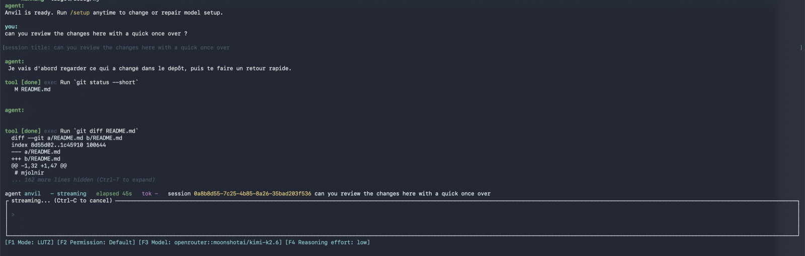
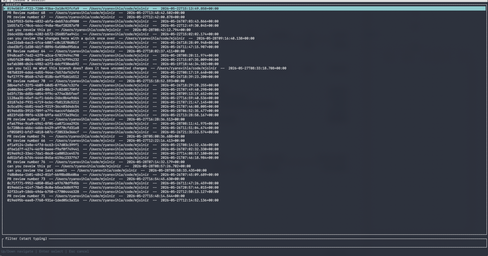
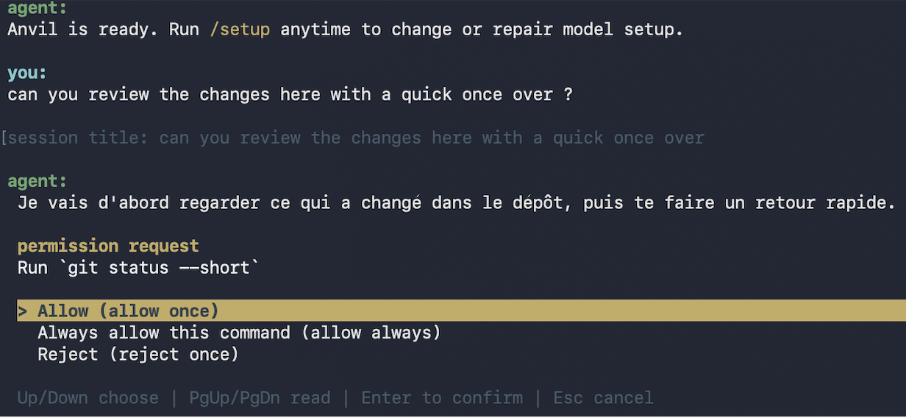

# mjolnir

Mjolnir is becoming the terminal home for Thor: an omni-agent coordinator that
routes coding work across ACP harnesses while keeping the user experience to one
prompt, one plan, and one recap.

Claude Code for the corporate repo. Codex for the OpenAI workflow. OpenCode or
Goose for local and open-source setups. Amp, Cursor, Cline, Copilot, Junie,
Qwen, Kimi, or Pi when a project or model family calls for it. Mjolnir keeps the
harnesses and gives them one terminal workflow: same transcript, same tool
cards, same permission prompts, same session resume.

The harness still matters. It may own the auth your company approved, the model
access your team standardized on, the runtime you trust, or the policy layer
that keeps a repo safe. Mjolnir removes the part where choosing the right
worker also means switching UIs, keyboard habits, and session history.

It is native and small-footprint: no Electron shell, no browser runtime, no
agent-specific frontend.

Thor is the simple path: give it the task, review the plan, then let it assign
work to configured ACP harnesses. Today `mj` defaults to the `anvil` ACP
backend (`uvx brokk acp`) as the first Thor host. `mj` injects a local MCP
bridge into that host session so Thor can discover and run worker ACP agents.
On first run, `mj` shows the Thor coordinator configuration before starting a
session and writes a visible `[thor]` section to `~/.config/mj/config.toml`.



## Getting Started

Install the latest `mj` and `bifrost` release binaries:

```bash
curl -fsSL https://raw.githubusercontent.com/BrokkAi/mjolnir/master/install.sh | bash
```

The installer writes to `~/.local/bin` by default and offers to add that
directory to your shell profile when needed. Set `INSTALL_DIR` or
`MJOLNIR_INSTALL_DIR` to install somewhere else.

Then open a repo and run `mj`. The short binary name is intentional; nobody
wants to type `mjolnir` every time they ask an agent to look at a diff.

```bash
mj
```

The default `anvil` backend runs `uvx brokk acp`, so `uvx` must be available on
`PATH` unless you configure a different backend in `~/.config/mj/config.toml`.

## Quick Start

By default, `mj` starts Thor inside the configured ACP host. On first run, setup
asks where Thor should run, then starts with the saved Thor defaults for work
style, model preference, and reasoning level. Configured agents that validate
successfully are made available to Thor automatically. The normal prompt flow
does not ask the user to choose a model or agent.

```
 mj
+--- thor ---------------------------------------------------+
| Ask for the work. Thor plans, routes, executes, reviews.   |
| Default Thor host: anvil (`uvx brokk acp`)                 |
+------------------------------------------------------------+
```

Thor preferences, configured ACP servers, and quota backend metadata are stored in
`~/.config/mj/config.toml`.

Use `/new` inside the TUI to start a fresh Thor session with the configured
backend. Use `/load` to open the session picker for the current backend.

## Install Options

The recommended install path is the shell installer:

```bash
curl -fsSL https://raw.githubusercontent.com/BrokkAi/mjolnir/master/install.sh | bash
```

It installs the latest `mj` and `bifrost` release binaries on macOS, Linux, and
Android/Termux, verifies published `.sha256` checksums when present, and writes
to `~/.local/bin` unless `INSTALL_DIR` or `MJOLNIR_INSTALL_DIR` is set.

To install a specific release:

```bash
MJOLNIR_VERSION=v0.10.6 \
  bash -c "$(curl -fsSL https://raw.githubusercontent.com/BrokkAi/mjolnir/master/install.sh)"
```

Set `BIFROST_VERSION` as well only when you need a specific `bifrost` release.

Windows users should download the `x86_64-pc-windows-msvc.zip` asset from the
GitHub release page, verify it against the adjacent `.sha256` file, and put
`mj.exe` on `PATH`.

Rust users can install from source:

```bash
cargo install --git https://github.com/BrokkAi/mjolnir.git
```

On Linux, install ALSA development headers first because microphone dictation
links against ALSA, for example `sudo apt-get install libasound2-dev` on
Debian/Ubuntu.

## Thor Routing

Thor is a coordinator persona running inside an ACP host agent. Onboarding
validates configured/custom/default ACP servers, lets the user choose where Thor
runs, and persists the usable configured server instances. Thor only sees
configured ACP servers, not every registry possibility and not locally installed
provider CLIs by themselves.

`mj` passes a stdio MCP bridge (`mj thor-mcp`) to the host through ACP
`mcpServers`; the MCP tools validate configured ACP workers, list usable
workers, and run assigned tasks through worker sessions. The bridge also exposes
a cached model catalog from LM Arena/OpenRouter sources, optional real ACP
validation on the configured worker inventory, and a concurrent worker runner
that reports structured progress, tool calls, and aggregate usage.

Quota is separate from ACP discovery/validation. A configured Claude-backed ACP
server can have a `claude-cli` quota backend, which reads the installed Claude
CLI with `/usage`. A configured Codex-backed ACP server can have a
`codex-appserver` quota backend, which reads installed Codex appserver rate
limits. If no configured ACP server declares that backend, the provider CLI is
not exposed to Thor as a worker.

Initial routing policy:

- support routing modes: balanced, cost/accountant, and
  best-solution/architect
- rank model strength from cached LM Arena leaderboard metadata
- use OpenRouter model pricing for non-subscription cost comparisons
- prefer Claude Code for Claude-family models when configured
- prefer Codex for GPT/OpenAI-family models when configured
- prefer Anvil for other model families when configured for the target model
- use Claude Code and Codex subscription quota evenly and maximally before
  falling back to metered OpenRouter routing; quota is treated as known only
  when the direct Claude Code or Codex appserver query succeeds
- in cost/accountant mode, use cheaper models when Thor judges the task simple
  enough
- in best-solution/architect mode, run two independent implementations with
  different model families for complex work, then have Thor compare and choose
  the better result
- always run an adversarial review and correction cycle before finalizing;
  prefer different vendor models for review when capacity allows

See [docs/thor-coordinator-plan.md](docs/thor-coordinator-plan.md) for the
current implementation plan.

## Why Multiple Harnesses

Thor is not a lowest-common-denominator model picker. The point is to keep each
agent in the harness where it is strongest while giving the user one terminal
workflow.

- Use Claude Code when a company repo already depends on that auth, policy, or
  review style.
- Use Codex when you want the OpenAI coding-agent workflow for edit/test/fix
  loops.
- Use Qwen, Kimi, Pi, or Copilot when a different model family should inspect a
  design, explain a failure, or challenge a patch.
- Use OpenCode, Goose, or a custom ACP command for open-source, local, or
  Ollama-backed work.
- Use Amp, Cursor, Cline, Junie, or another registry harness when a project
  already has a preferred agent.

Without Thor, those choices usually mean several interfaces. With Thor, they are
worker options behind one coordinated TUI.

## Parallel Workspaces

Use `--worktree` to run multiple agents against the same project without sharing
one checkout:

```bash
mj --worktree
```

With no value, `mj` creates a linked Git worktree below
`<project>/.mjolnir/worktrees/` and runs the ACP session from the matching
directory inside it. Keep worktrees around and start more sessions in parallel:

```bash
mj --worktree swift-dawn
mj --worktree quiet-forge
```

Each terminal can run a separate Thor session. Resume a kept worktree session
with:

```bash
mj resume <session-id> --worktree swift-dawn
```

## Resume Sessions

`mj resume` opens a searchable session picker for the configured Thor backend,
so you can jump back into previous ACP sessions without remembering IDs.



Useful forms:

- `mj resume`: list sessions from the configured Thor backend and resume one
  interactively.
- `mj resume <session-id>`: resume that session ID from the configured Thor
  backend.
- `mj resume --list`: list sessions from the configured Thor backend.
- `mj resume --list --format json`: print the session list as JSON.

## Permissions

Permission prompts stay in the same terminal flow and keep the requested command
visible while you choose whether to allow, always allow, or reject it.



## Automation

Use `--print` for one-shot prompts through the same Thor coordinator path:

```bash
mj --print "summarize the current diff"
git diff | mj --print -
```

Use `--output-format json` or `--output-format stream-json` when another tool
needs structured output. `--permission-mode` controls how headless runs respond
to permission prompts; the default rejects prompts so automation does not hang.

## Reference

Common options:

- `--cwd`: workspace directory used for the ACP session. Defaults to the current
  directory.
- `-p, --print [PROMPT]`: run one prompt non-interactively and print the result.
  Omit the value or pass `-` to read stdin.
- `--output-format`: output format for `--print`. Values: `text`, `json`,
  `stream-json`.
- `-w, --worktree`: create a linked Git worktree, or reuse an existing worktree
  by short name or path when a value is provided.
- `--debug-file` (alias: `--log-file`): write TUI logs to a file. Equivalent
  env var: `BROKK_TUI_LOG`.
- `--agent-stderr`: capture the agent subprocess stderr to a file. Equivalent
  env var: `BROKK_TUI_AGENT_STDERR`.
- `--fullscreen-tui`: use the legacy alternate-screen full-screen chat UI. The
  default is inline chat.
- `--permission-mode`: controls headless `--print` permission handling. Values:
  `default`, `acceptEdits`, `bypassPermissions`.

Keyboard basics:

- `Enter`: send the current prompt, or accept the selected slash command.
- `Tab`: accept the selected slash command.
- `Up` / `Down`: move within slash-command autocomplete or permission prompts.
- `PageUp` / `PageDown`: scroll the transcript.
- `F10`: show or hide the help overlay.
- `F1`..`F9`: edit visible session config options.
- `Esc`: dismiss autocomplete, clear input, or cancel a permission prompt.
- `Ctrl-C`: cancel an in-flight prompt; when idle with an empty input, quit.
- `Ctrl-D`: quit when the input is empty.
- `🎙 Ctrl-R` (non-Android): start/stop microphone dictation into the prompt.
  Dictation uses in-process sherpa-onnx speech recognition with Silero VAD and
  the multilingual Parakeet TDT v3 model; the model (~0.7 GB) is downloaded and
  cached under `~/.cache/mj/voice/` on first use.

On-disk files:

- `~/.config/mj/config.toml`: Thor preferences and the configured backend
  (program + args + env).
- `<project>/.mjolnir/worktrees/`: linked Git worktrees created by
  `mj --worktree`.

Paste text with more than 3 lines into the prompt and it appears as a compact
chip instead of raw text. Press `Enter` to send chip contents with your typed
prompt, `Backspace` on an empty input to remove the last chip, or `Esc` to clear
the input.

## Development

You only need Rust when building from source or contributing. On Linux,
microphone dictation links against ALSA, so install its development headers
first (e.g. `sudo apt-get install libasound2-dev` on Debian/Ubuntu).

```bash
cargo build --release
./target/release/mj
```

Use the same checks as CI before submitting changes:

```bash
cargo fmt --check
cargo clippy --all-targets -- -D warnings
cargo test
cargo build --release
```

The crate uses inline unit tests under `src/`. Keep runtime, UI state, event,
rendering, install, and configuration concerns separated across the existing
modules.

## License

`mjolnir` is licensed under GPL-3.0. See [LICENSE](LICENSE).
