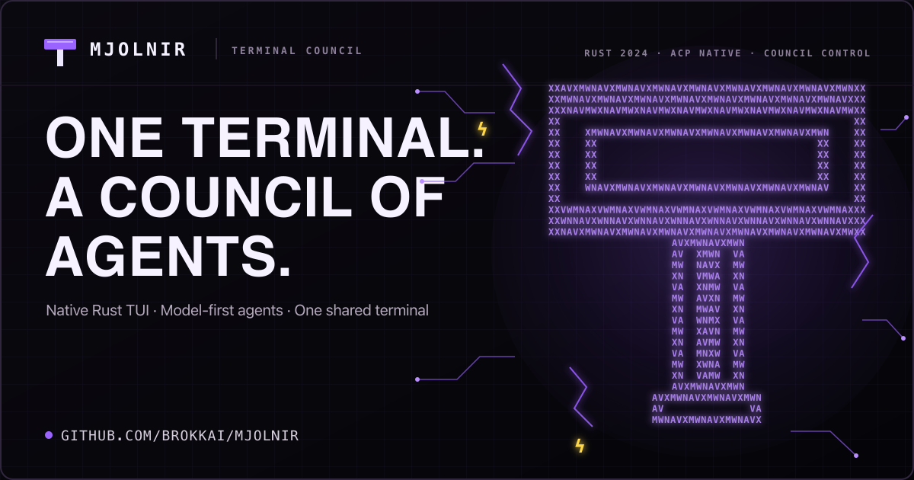

<h1 align="center">Mjolnir</h1>

<p align="center">
  <a href="https://mjolnir.brokk.ai/">
    
  </a>
</p>

Mjolnir (`mj`) is a native Rust ACP client with a model-first coding Council:

- **Thor** coordinates the user turn.
- **Eitri** implements delegated coding tasks or explores the codebase.
- **Loki** reviews work asynchronously and returns advice at useful boundaries.

Mjolnir selects models first, then routes them through locally available Agent
Client Protocol adapters. The active adapter remains an implementation detail,
so transcripts, permissions, tools, terminals, sessions, and keyboard workflow
stay consistent.


## Requirements

You need at least one supported model-provider account and launchable ACP route.
Existing Codex, Claude, or Kimi credentials can enable built-in routes; Anvil is
also managed as a bundled or downloaded route. Provider use may incur cost.

Codex and Claude ACP bridges use Node.js/npm and their PATH-visible vendor CLIs. Mjolnir can install
the Kimi adapter and other binary ACP agents from the public ACP registry. Read
[installation](https://mjolnir.brokk.ai/install/) and the
[data and trust boundaries](https://mjolnir.brokk.ai/data-boundaries/)
before connecting a private repository.

## Install and run

The release installer supports macOS and Linux on x86-64 or ARM64, plus Android ARM64:

```bash
curl -fsSL https://raw.githubusercontent.com/BrokkAi/mjolnir/master/install.sh | bash
```

It installs `mj` and Bifrost; desktop installs also include
`mj-voice-worker`. Windows users should use a release archive or Cargo.

Desktop users can install Mjolnir and its optional voice worker from crates.io:

```bash
cargo install --locked brokk-mjolnir brokk-mj-voice-worker
```

Then open a repository and run:

```bash
mj
```

Use `/mjconfig` to choose models, sign in, configure ACP servers, set the review
policy, and change appearance. Model and adapter changes apply to the next
session.

## Try it

The [10-minute evaluation](https://mjolnir.brokk.ai/evaluate/) uses a
checked-in disposable fixture to exercise Thor, an Eitri implementation
handoff, explicit review, session resume, and headless output without risking a
real repository.

For a quick read-only headless check:

```bash
mj --print --permission-mode manual "summarize this repository; do not modify files"
```

Use an isolated worktree for an interactive coding session:

```bash
mj --worktree
```

## Documentation

- [Overview](https://mjolnir.brokk.ai/overview/)
- [Install and run](https://mjolnir.brokk.ai/install/)
- [10-minute evaluation](https://mjolnir.brokk.ai/evaluate/)
- [Thor, Eitri, and Loki](https://mjolnir.brokk.ai/council/)
- [Permissions and workspace scope](https://mjolnir.brokk.ai/permissions/)
- [Sessions, worktrees, and resume](https://mjolnir.brokk.ai/sessions-worktrees/)
- [Headless automation](https://mjolnir.brokk.ai/headless/)
- [Remote control](https://mjolnir.brokk.ai/remote/)
- [License and use cases](https://mjolnir.brokk.ai/license-use-cases/)
- [Data and trust boundaries](https://mjolnir.brokk.ai/data-boundaries/)

## Contributing

See [CONTRIBUTING.md](CONTRIBUTING.md) for development setup, runtime
invariants, tests, dependency-license maintenance, and the release checklist.
Repository-specific agent guidance lives in [AGENTS.md](AGENTS.md).

## License

Mjolnir and its voice worker are licensed under `GPL-3.0-only`. See
[LICENSE](LICENSE). Official release archives include the corresponding source
offer, dependency reports, supplemental notices, and the legal bundle for the
shipped Anvil binary. See [License and use cases](https://mjolnir.brokk.ai/license-use-cases/)
and [Third-party notices](https://mjolnir.brokk.ai/third-party-notices/).
