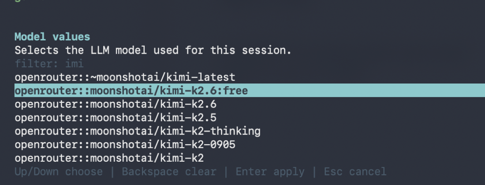

# mjolnir

Mjolnir lets you use nearly every coding-agent harness from one fast,
consistent, featureful Rust TUI.

Claude Code for the corporate repo. Codex for the OpenAI workflow. OpenCode or
Goose for local and open-source setups. Amp, Cursor, Cline, Copilot, Junie,
Qwen, Kimi, or Pi when a project or model family calls for it. Mjolnir keeps the
harnesses and gives them one terminal workflow: same transcript, same tool
cards, same permission prompts, same session resume.

The harness still matters. It may own the auth your company approved, the model
picker your team standardized on, the runtime you trust, or the policy layer
that keeps a repo safe. Mjolnir just removes the part where choosing the right
agent also means switching UIs, keyboard habits, and session history.

It is native and small-footprint: no Electron shell, no browser runtime, no
agent-specific frontend.

Each session chooses its own harness from the official
[ACP registry](https://github.com/agentclientprotocol/registry), the bundled
`anvil` default, or a custom command. The agent changes. The working rhythm does
not.


## Getting Started

Install the latest `mj`, `anvil`, and `bifrost` release binaries:

```bash
curl -fsSL https://raw.githubusercontent.com/BrokkAi/mjolnir/master/install.sh | bash
```

The installer writes to `~/.local/bin` by default and offers to add that
directory to your shell profile when needed. Set `INSTALL_DIR` or
`MJOLNIR_INSTALL_DIR` to install somewhere else.

Then open a repo and run `mj`. The short binary name is intentional; nobody
wants to type `mjolnir` every time they ask an agent to look at a diff.

```bash
mj
```

Network access is needed the first time `mj` fetches the ACP registry unless you
only use `anvil`, a custom command, or an already-cached registry copy. Registry
agents distributed through `npx` or `uvx` require the matching runtime on
`PATH`.

## Quick Start

Every new interactive session opens the agent picker. Choose an agent from the
ACP registry, the bundled `anvil` default, or a custom ACP command.

```
 mj | choose an agent
+--- agents -------------------------------------------------+
| > anvil [current]    -- default mj agent                   |
|   Claude              -- npx v0.36.1                       |
|   Codex               -- binary v0.14.0                    |
|   ...                                                      |
|   Custom command...   -- type your own command             |
+------------------------------------------------------------+
```

Registry binary distributions are downloaded to
`~/.cache/mj/agents/<id>/<version>/` and reused. Picker preferences are stored in
`~/.config/mj/config.toml`.

Use `/new` inside the TUI to end the current chat and pick a harness again. Use
`/load` to open the session picker for the current agent.

## Why Multiple Harnesses

`mj` is not a lowest-common-denominator model picker. The point is to keep each
agent in the harness where it is strongest while giving all of them the same
terminal workflow.

- Use Claude Code when a company repo already depends on that auth, policy, or
  review style.
- Use Codex when you want the OpenAI coding-agent workflow for edit/test/fix
  loops.
- Use Qwen, Kimi, Pi, or Copilot when a different model family should inspect a
  design, explain a failure, or challenge a patch.
- Use OpenCode, Goose, or a custom ACP command for open-source, local, or
  Ollama-backed work.
- Use Amp, Cursor, Cline, Junie, or another registry harness when a project
  already has a preferred agent.

Without `mj`, those choices usually mean several interfaces. With `mj`, they are
different sessions in the same TUI.

## Parallel Workspaces

Use `--worktree` to run multiple agents against the same project without sharing
one checkout:

```bash
mj --worktree
```

With no value, `mj` creates a linked Git worktree below
`<project>/.mjolnir/worktrees/` and runs the ACP session from the matching
directory inside it. Keep worktrees around and start more sessions in parallel:

```bash
mj --worktree swift-dawn
mj --worktree quiet-forge
```

Each terminal can choose a different registry agent or custom command. Use one
agent to implement, another to review, and a local harness to experiment. Resume
a kept worktree session with:

```bash
mj resume <session-id> --worktree swift-dawn
```

## Resume Sessions

`mj resume` opens a searchable session picker for the selected agent, so you can
jump back into previous ACP sessions without remembering IDs.


Useful forms:

- `mj resume`: choose an agent, list its sessions, and resume one
  interactively.
- `mj resume <session-id>`: choose an agent, then resume that session ID.
- `mj resume --list`: list sessions from the configured default agent.
- `mj resume --list --format json`: print the session list as JSON.

## Permissions And Config

Permission prompts stay in the same terminal flow and keep the requested command
visible while you choose whether to allow, always allow, or reject it.


Agents can expose session-specific configuration through ACP. `mj` renders those
options as searchable terminal pickers, so model and mode changes do not require
leaving the chat.



## Automation

Use `--print` for one-shot prompts with the same configured ACP agent:

```bash
mj --print "summarize the current diff"
git diff | mj --print -
```

Use `--output-format json` or `--output-format stream-json` when another tool
needs structured output. `--permission-mode` controls how headless runs respond
to permission prompts; the default rejects prompts so automation does not hang.

## Reference

Common options:

- `--cwd`: workspace directory used for the ACP session. Defaults to the current
  directory.
- `-p, --print [PROMPT]`: run one prompt non-interactively and print the result.
  Omit the value or pass `-` to read stdin.
- `--output-format`: output format for `--print`. Values: `text`, `json`,
  `stream-json`.
- `-w, --worktree`: create a linked Git worktree, or reuse an existing worktree
  by short name or path when a value is provided.
- `--debug-file` (alias: `--log-file`): write TUI logs to a file. Equivalent
  env var: `BROKK_TUI_LOG`.
- `--agent-stderr`: capture the agent subprocess stderr to a file. Equivalent
  env var: `BROKK_TUI_AGENT_STDERR`.
- `--fullscreen-tui`: use the legacy alternate-screen full-screen chat UI. The
  default is inline chat.
- `--permission-mode`: controls headless `--print` permission handling. Values:
  `default`, `acceptEdits`, `bypassPermissions`.

Keyboard basics:

- `Enter`: send the current prompt, or accept the selected slash command.
- `Tab`: accept the selected slash command.
- `Up` / `Down`: move within slash-command autocomplete or permission prompts.
- `PageUp` / `PageDown`: scroll the transcript.
- `F10`: show or hide the help overlay.
- `F1`..`F9`: edit visible session config options.
- `Esc`: dismiss autocomplete, clear input, or cancel a permission prompt.
- `Ctrl-C`: cancel an in-flight prompt; when idle with an empty input, quit.
- `Ctrl-D`: quit when the input is empty.

On-disk files:

- `~/.config/mj/config.toml`: picker preferences and the default selected agent
  (program + args + env).
- `~/.cache/mj/registry.json`: cached registry index, refreshed every 24h.
- `~/.cache/mj/agents/<id>/<version>/`: extracted binary distributions.
- `<project>/.mjolnir/worktrees/`: linked Git worktrees created by
  `mj --worktree`.

Paste text with more than 3 lines into the prompt and it appears as a compact
chip instead of raw text. Press `Enter` to send chip contents with your typed
prompt, `Backspace` on an empty input to remove the last chip, or `Esc` to clear
the input.

## Development

You only need Rust when building from source or contributing.

```bash
cargo build --release
./target/release/mj
```

Use the same checks as CI before submitting changes:

```bash
cargo fmt --check
cargo clippy --all-targets -- -D warnings
cargo test
cargo build --release
```

The crate uses inline unit tests under `src/`. Keep runtime, UI state, event,
rendering, registry, install, and picker concerns separated across the existing
modules.

## License

`mjolnir` is licensed under GPL-3.0. See [LICENSE](LICENSE).
